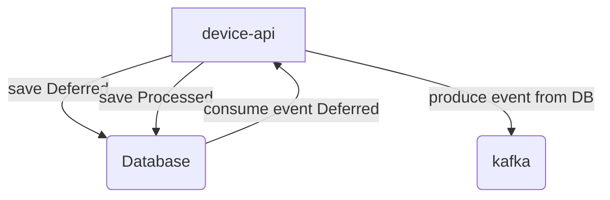

Требования к сервису act-device-api

# Назначение

Сервис предназначен для регистрации мобильных устройств и отправки уведомлений по ним.
Сервис должен поддерживать работу по протоколам: gRpc и Rest api.

# 1. Описание протокола act_device_api

## 1.1 Создание устройства

Сервис должен обеспечивать возможность создания устройства.

### gRPC

Запрос на создание устройства (CreateDeviceV1Request) должен включать следующие поля:

| Поле     | Тип данных | Описание              | Валидация                                 |
|----------|------------|-----------------------|-------------------------------------------|
| platform | String     | Платформа ios/android | Мин 1 символ. Может быть любая строка |
| user_id  | Uint64     | Id пользователя.      | Не нулевое                                |

Запрос должен возвращать CreateDeviceV1Response со следующими полями:

| Поле      | Тип данных | Описание                 |
|-----------|------------|--------------------------|
| device_id | Uint64     | Уникальное ID устройства |

### Rest

Rest протокол должен соответствовать gRPC
и обрабатываться посредством POST запросы по пути /api/v1/devices:

| Поле     | Тип данных     | Описание              | Валидация                                 |
|----------|----------------|-----------------------|-------------------------------------------|
| platform | String         | Платформа ios/android | Мин 1 символ. Может быть любая строка |
| user_id  | String(Uint64) | Id пользователя.      | Не нулевое                                |

### БД

При создании устройство должно сохраняться в БД в табличном виде:

| Поле       | Тип данных  | Описание                                   |
|------------|-------------|--------------------------------------------|
| Id         | integer     | Уникальное ID устройства                   |
| platform   | Varchar(32) | Имя платформы                              |
| removed    | boolean     | Признак удаления устройства (см пункт 1.4) |
| user_id    | Bigint      | Id пользователя                            |
| entered_at | Timestamp   | Timestamp создания устройства в приложении |
| created_at | Timestamp   | Timestamp создания устройства  в БД        |
| updated_at | Timestamp   | Timestamp - последнего обновления          |

### Логика

При создании устройства - должна произойти запись о созданном устройстве в таблицу Devices.
А также отправлено уведомление о создании устройства в Kafka см пункт: 4

## 1.2 Получение информации об устройстве

### gRPC

Запрос информации об устройстве DescribeDeviceV1Request должен содержать:

| Поле      | Тип данных | Описание                 |
|-----------|------------|--------------------------|
| device_id | Uint64     | Уникальное ID устройства |

На запрос должен возвращаться ответ DescribeDeviceV1Response со следующими полями:

| Поле       | Тип данных | Описание                                   |
|------------|------------|--------------------------------------------|
| Id         | uint64     | Уникальное ID устройства                   |
| platform   | String     | Имя платформы                              |
| user_id    | uint64     | Id пользователя                            |
| entered_at | Timestamp  | Timestamp создания устройства в приложении |

### REST

Соответствующий запрос в HTTP протоколе должен происходить с помощью GET /api/v1/devices/{device_id},
где device_id - ID - существующего устройства.

Сущность ошибки представлена следующими полями:

| Поле    | Тип данных | Описание             |
|---------|------------|----------------------|
| code    | int4       | Код ошибки           |
| message | String     | Текст ошибки         |
| details | Array      | Доп детали по ошибке |

### БД

Отсутствует

### Логика

При поступлении запроса на получение устройства - соответствующее актуальное устройство - должно быть возвращено в
ответе.

Если ID не существует или устройство было удалено - должна вернуться 404 ошибка
со следующим содержимым:

| Поле    | Значение         |
|---------|------------------|
| code    | 5                |
| message | device not found |

## 1.3 Редактирование устройства

Устройство может быть отредактировано с помощью запроса: UpdateDeviceV1Request, на который должен прийти ответ
UpdateDeviceV1Response.

### gRPC

UpdateDeviceV1Request

| Поле      | Тип данных | Описание                                         |
|-----------|------------|--------------------------------------------------|
| device_id | uint64     | Ненулевое Уникальное ID устройства               |
| platform  | String     | Имя платформы, Не больше 32 символов, Не пустое. |
| user_id   | uint64     | Ненулевое ID пользователя во внешней системе     |

UpdateDeviceV1Response

| Поле    | Тип данных | Описание                                                        |
|---------|------------|-----------------------------------------------------------------|
| success | Boolean    | Результат выполнения операции True - успешно, False - неуспешно |

### Rest

При отправке PUT запроса по пути `/api/v1/devices/{device_id}`, где device_id - id существующего устройства в системе.

Тело запроса JSON с полями:

| Поле     | Тип данных | Описание                           |
|----------|------------|------------------------------------|
| platform | String     | Платформа - Длина 32 символа       |
| userId   | uint64     | ID пользователя во внешней системе |

### Логика
При поступлении запроса на обновление, существующего устройства, запись об устройстве, должна быть обновлена в таблице Devices. Поле Updated_At должно быть обновлено на timestamp времени
обновления.
Запись о событии обновления, должна быть отправлена в Kafka см пункт 4.
При поступлении запроса на обновление, не существующего или удаленного устройства - должна быть возвращен ответ UpdateDeviceV1Response c полем success =
False.

## 1.4 Удаление устройства

Система должна поддерживать функционал удаление устройства.

### gRPC

RemoveDeviceV1Request

| Поле      | Тип данных | Описание                           |
|-----------|------------|------------------------------------|
| device_id | uint64     | Ненулевое Уникальное ID устройства |

RemoveDeviceV1Response

| Поле  | Тип данных | Описание                   |
|-------|------------|----------------------------|
| found | bool       | Статус удаления устройства |

### Rest

Для REST протокола, удаление должно происходить при получении запроса:
`DELETE /api/v1/devices/{device_id}`, где device_id - id существующего устройства.

### БД

Добавить в таблицу Devices следующие поля:

| Поле    | Тип данных | Описание                    |
|---------|------------|-----------------------------|
| deleted | bool       | Признак удаления устройства |

### Логика:

При поступлении запроса с существующим device_id, устройство с таким идентификатором помечается как удаленное.
Если устройство уже помечено, как удаленное - возвращается ответ RemoveDeviceV1Response со статусом found = false.

При получении запроса на удаление устройства - необходимо обновить в таблице Devices:
Поле deleted в соответствующем устройстве - проставляется как True.
Удаленные устройства не отображаются в списке устройств.
Удаленное устройство невозможно запросить по ID.
Удаленное не может быть отредактировано.
При удалении - должен отправляться соответствующий Event в Kafka.

## 1.5 Список устройств

При запросе списка доступных устройств - должна вернуться соответствующая таблица, отсортированного списка устройства.

### GRPC

ListDevicesV1Request

| Поле     | Тип данных | Описание                               |
|----------|------------|----------------------------------------|
| page     | uint64     | Страница списка устройств              |
| per_page | uint64     | Количество устройств на странице (>=1) |

ListDevicesV1Response

| Поле  | Тип данных | Описание            |
|-------|------------|---------------------|
| items | []Device   | Коллекция устройств |

Device

| Поле       | Тип данных | Описание                            |
|------------|------------|-------------------------------------|
| id         | uint64     | ID устройства                       |
| platform   | string     | Платформа ios/android               |
| user_id    | uint64     | UserID устройсва во внешней системе |
| entered_at | Timestamp  | Дата-время создания устройства      |

### Rest

Соответствующй мапиинг должен быть проброшен на запрос GET /api/v1/devices
с параметрами:

| Поле     | Тип данных | Описание                                              |
|----------|------------|-------------------------------------------------------|
| page     | string     | (Обязательный) Страница списка устройств              |
| per_page | string     | (Обязательный) Количество устройств на странице (>=1) |

### БД

Отсутствует

### Логика

При поступлении запроса - должен быть вычислена страница, исходя из переданного размера и должна быть возвращена в
Ответ.

## 2.0 Описание протокола act_notification_api

### 2.1 Отправка уведомлений по устройству*

#### GRPC

SendNotificationV1Request

| Поле         | Тип данных   | Описание                                |
|--------------|--------------|-----------------------------------------|
| notification | Notification | (Обязательный) Уведомление для отправки |

Notification

| Поле               | Тип данных | Описание                                                    |
|--------------------|------------|-------------------------------------------------------------|
| notificationId     | uint64     | (Необязательное) ID уведомления                             |
| deviceId           | uint64     | ID устройства - на которое необходимо отправить уведомление |
| message            | string     | Текст сообщения                                             |
| lang               | Language   | Язык сообщения                                              |
| notificationStatus | Status     | Статус отправки сообщения                                   |

Language

| Поле         | Значение в БД | Описание    |
|--------------|---------------|-------------|
| LANG_ENGLISH | 1             | Английский  |
| LANG_RUSSIAN | 2             | Русский     |
| LANG_ESPANOL | 3             | Испанский   |
| LANG_ITALIAN | 4             | Итальянский |

Status

| Поле               | Значение в БД | Описание                        |
|--------------------|---------------|---------------------------------|
| STATUS_CREATED     | 1             | Уведомление создано             |
| STATUS_IN_PROGRESS | 2             | Уведомление в процессе отправки |
| STATUS_DELIVERED   | 3             | Уведомление доставлено          |

SendNotificationV1Response

| Поле           | Тип данных | Описание       |
|----------------|------------|----------------|
| notificationId | uint64     | ID уведомления |

#### HTTP

Отправка уведомления осуществляется в виде запроса по ручке POST /api/v1/notification

`{ "notification":{ "deviceId":"1" "Message":"Привет" "lang":"RUSSIAN" } }`

#### БД

user_notifications

| Поле       | Тип данных | Описание                                                           |
|------------|------------|--------------------------------------------------------------------|
| id         | integer    | Id записи в таблице                                                |
| device_id  | bigint     | Id устройства                                                      |
| username   | string     | Имя пользователя                                                   |
| message    | string     | Строка с текстом сообщения                                         |
| lang       | smallint   | Язык текста сообщения (Номер в справочнике Языки)                  |
| status     | smallint   | Индекс статуса получения уведомления (Номер в справочнике Статусы) |
| payload    | jsonb      | Json с уведомлением                                                |
| created_at | uint64     | Дата создания уведомления                                          |
| updated_at | uint64     | Дата последнего обновления уведомления                             |

#### Логика

При получении запроса на отправку уведомления, по существующему устройству, система должна:

1. Записать уведомление в Базу данных в статусе STATUS_CREATED. Сохранить время поступления уведомления.
    1. Итоговый текст уведомления должен быть сформирован исходя из следующей логики:
        1. Текст уведомления должен быть сформирован по шаблону: `{Greetings}, {text}.`
        2. Текст приветствия, должен быть сформирован на том языке, который указан в запросе.
            1. Если запрос на отправку уведомления пришел с 6 до 11 утра по Москве - то текст приветствия должен быть
               сформирован согласно таблице Приветствия - Утро
            2. Если запрос на отправку уведомления пришел с 11 до 15 часа по Москве - то текст приветствия должен быть
               сформирован согласно таблице Приветствия - День
            3. Если запрос на отправку уведомления пришел с 15 до 21 часа по Москве - то текст приветствия должен быть
               сформирован согласно таблице Приветствия - Вечер
            4. Если запрос на отправку уведомления пришел после 21 по Москве - то текст приветствия должен быть
               сформирован согласно таблице Приветствия - Ночь
2. Отправить уведомление в активные сессии подписки.
3. Если Устройство не существует или было удалено - возвращать сообщение об ошибке.

Приветствия - Утро

| Язык         | Текст        |
|--------------|--------------|
| LANG_ENGLISH | Good morning |
| LANG_RUSSIAN | Доброе утро  |
| LANG_ESPANOL | Buenos dias  |
| LANG_ITALIAN | Buon giorno  |

Приветствия - День

| Язык         | Текст           |
|--------------|-----------------|
| LANG_ENGLISH | Good afternoon  |
| LANG_RUSSIAN | Добрый день     |
| LANG_ESPANOL | Buenas tardes   |
| LANG_ITALIAN | Buon pomeriggio |

Приветствия - Вечер

| Язык         | Текст         |
|--------------|---------------|
| LANG_ENGLISH | Good evening  |
| LANG_RUSSIAN | Добрый вечер  |
| LANG_ESPANOL | Buenas noches |
| LANG_ITALIAN | Buona serata  |

Приветствия - Ночь

| Язык         | Текст         |
|--------------|---------------|
| LANG_ENGLISH | Good night    |
| LANG_RUSSIAN | Доброй ночи   |
| LANG_ESPANOL | Buenas noches |
| LANG_ITALIAN | Buona notte   |

В случае, если устройство не существует - должна отправляться ошибка.
Если устройство существует - то уведомление должно быть сохранено в Базу со статусом STATUS_CREATED.

### 2.2 Получение уведомлений по устройству

#### GRPC

GetNotificationV1Request

| Поле     | Тип данных | Описание                       |
|----------|------------|--------------------------------|
| deviceId | uint64     | (Необязательное) ID устройства |

GetNotificationV1Response

| Поле         | Тип данных       | Описание                       |
|--------------|------------------|--------------------------------|
| notification | UserNotification | Коллекция - список уведомлений |

UserNotification

| Поле           | Тип данных | Описание                       |
|----------------|------------|--------------------------------|
| notificationId | uint64     | Коллекция - список уведомлений |
| message        | string     | Полный текст уведомления       |

#### HTTP

Должны быть отправлены 10 последних уведомлений при поступлении запроса вида:
`GET /api/v1/notification?deviceId=1111`

#### БД

#### Логика

* Если пришел запрос с ненулевым notificationId - Вернуть коллекцию из 1 уведомления.
* Если пришел запрос с ненулевым deviceId - вернуть последние 10 уведомлений в статусах: STATUS_CREATED,
* STATUS_IN_PROGRESS.
* Если уведомление хотя бы 1 раз было отправлено в статусе STATUS_CREATED - необходимо сменить для данного уведомления
* статус в БД на STATUS_IN_PROGRESS.
* Если в запросе указаны одновременно notificationId и deviceId - запрос должен быть обработан по логики c notificationId.
* Если указан notificationId = 0 - это означает отсутствие данного поля.
* Если указан deviceId = 0 - это означает отсутствие данного поля.

### 2.3 Подтверждение получения уведомления

#### GRPC

AckNotificationV1Request

| Поле           | Тип данных | Описание       |
|----------------|------------|----------------|
| notificationId | uint64     | ID уведомления |

AckNotificationV1Response

| Поле    | Тип данных | Описание             |
|---------|------------|----------------------|
| success | boolean    | Статус подтверждения |

#### HTTP

Получение уведомления также можно подтвердить при помощи PUT запроса с параметром:
`PUT /api/v1/notification/ack/{notification_id}`

#### БД

Нет

#### Логика

При получении подтверждения отправки уведомления необходимо:

1. Сменить статус уведомления с STATUS_IN_PROGRESS в STATUS_DELIVERED в БД.
2. Вернуть в ответе на запрос статус подтверждения - success = True.

Если уведомление уже было в статусе STATUS_DELIVERED - Ничего не делать.

Если возникла ошибка в процессе обработки записи - необходимо оставить предыдущий статус - и вернуть в ответе на запрос
в поле success = false.

### 2.4 Подписка на получение уведомлений

#### GRPC

SubscribeNotificationRequest

| Поле     | Тип данных | Описание      |
|----------|------------|---------------|
| deviceId | uint64     | ID Устройства |

#### HTTP

Подписаться на уведомления можно также по HTTP - но в этом случае - логика работы будет идентична пункту 2.3:
`GET /api/v1/notification/subscribe/{device_id}`

#### БД

Нет

#### Логика

При получении запроса на подписку уведомлений необходимо:

1. Отправить в сессию все уведомления в статусе STATUS_CREATED, STATUS_IN_PROGRESS, пачками по 10 штук, начиная от
   самого старого.
2. Если уведомление было отправлено в STATUS_CREATED - оно должно сменить статус в БД на STATUS_IN_PROGRESS.
3. Пока сессия не закрыта, новые уведомления должны приходить сразу же после отправки.
    1. В этом случае они должны быть записаны в базу сразу в статусе STATUS_IN_PROGRESS.

# 4 Интеграция с Kafka

## БД

Поля в таблице:

Статусы:

| Статус    | Индекс | Описание                          |
|-----------|:-------|-----------------------------------|
| Deferred  | 1      | Событие создано, но не отправлено |
| Processed | 2      | Событие отправлено                |

Тип события:

| Статус  | Индекс | Описание                       |
|---------|--------|--------------------------------|
| Created | 1      | Событие на создание устройства |
| Updated | 2      | Событие обновление устройства  |
| Deleted | 2      | Событие удаление устройства    |

devices_events

| Поле       | Тип данных | Описание                               |
|------------|------------|----------------------------------------|
| id         | integer    | Id записи в таблице                    |
| device_id  | bigint     | Id устройства                          |
| type       | smallint   | Индекс Типа события                    |
| status     | smallint   | Индекс статуса отправки уведомления    |
| payload    | jsonb      | Json с сущностью уведомления           |
| created_at | uint64     | Дата создания уведомления              |
| updated_at | uint64     | Дата последнего обновления уведомления |

## Логика

При создании, обновлении или удалении устройства, должно быть создано событие уведомление в соответствующем статусе (см. Типы событий), которое должно быть сохранено в БД и отправлено в Kafka-топик.
Событие, ДО записи в Kafka - должно быть дополнительно сохранено в devices_events с событиями в статусе Deferred.
Событие После записи в Kafka - Должно быть обновлено в Таблице с событиями в статусе: Processed.

